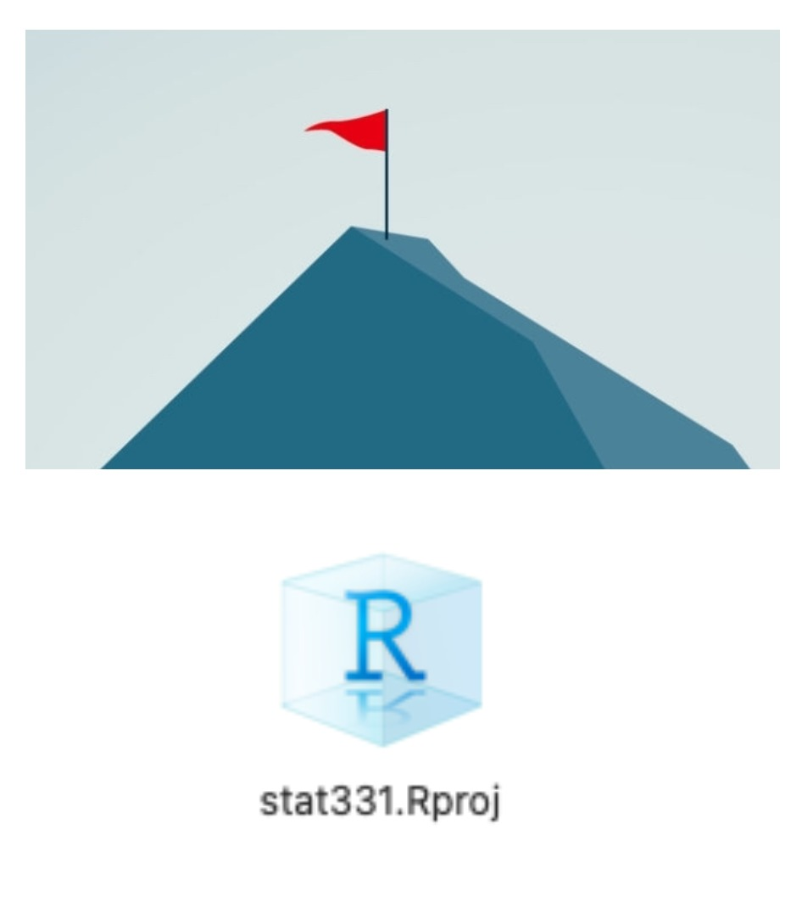

```{r setup, include=FALSE}
options(htmltools.dir.version = FALSE)
library(tidyverse)
library(fontawesome)
# devtools::install_github("r-for-educators/flair")
# library(flair)
```

```{r xaringan-themer, include=FALSE}
library(xaringanthemer)
mono_light(
  base_color = "#26116c",
  text_bold_color = "#fd5e53",
  title_slide_text_color = "#fff8e7",
  background_color = "#fff8e7",
  header_font_google = google_font("Roboto"),
  text_font_google   = google_font("Roboto Condensed"),
  code_font_google   = google_font("Droid Mono")
)
```

## Monday, January 9th

Today we will...

+ Welcome to Stat 331/531: Statistical Computing in R
+ Introduction
  + Intro to R + RStudio
  + Directories & File Paths
+ Troubleshooting
+ [PA 1: Find the Mistakes](https://earobinson95.github.io/stat331-calpoly/practice-activities/PA1-find-the-mistakes.html)

---
class: inverse, center, middle

# Intro to R & RStudio

---
## What is R?

**R** is a programming language designed originally for *statistical analyses*.

**R** was created by **Ross Ihaka** and **Robert Gentleman** in 1993.

_(Their names are why it's called **R**, which is also a joke about the predecessor
being called **S**.)_

**R** was formally released by the **R Core Group** in 1997.

[https://www.r-project.org/contributors.html](https://www.r-project.org/contributors.html)


This group of 20-ish volunteers are the *only* people who can change the **base** 
(built-in) functionality of **R**.

---
## Strengths


**R**'s **strengths** are...

... handling data with lots of **different types** of variables.

... making nice and complex data **visualizations**.

... having cutting-edge statistical **methods** available to users.

---
## Weaknesses

**R**'s **weaknesses** are...

... performing non-analysis programming tasks, like website creation. 

(*python*, *ruby*, ...)


... hyper-efficient numerical computation. 

(*matlab*, *C*, ...)

... being a simple tool for all audiences 

(*SPSS*, *STATA*, *JMP*, *minitab*, ...)

---
class: center, middle, invert

## But wait!


---
## Packages

The heart and soul of **R** is **packages**.

These are "extra" sets of code that add **new functionality** to R when installed.

"Official" **R** packages live on the *Comprehensive R Archive 
Network*, or **CRAN**

But anyone can write and share new code in "package form" (more later)

---
## Packages

To install a package use:

```{r, eval = F}
install.packages(tibble)
```

To load a package use:

```{r}
library(tibble)
```

---

## Open-Source

Importantly, **R** is *open-source*.

There is no company that owns **R**, like there is for *SAS* or *Matlab*.

(*Python* is also open-source!)

This means nobody can sell their **R** code!

* (but you can sell "helpers" like **RStudio**)

* (and you can keep code **private** within an organization or company)

**Packages are created by users like you and me!**

---
## Open-Source

Being a good open-source citizen means...

... **sharing** your code publicly when possible. 

(later in this course, we'll learn about *GitHub*!)

... **contributing** to public projects and packages, as you are able.

... creating your own **packages**, if you can.

... using **R** for **ethical and respectful** projects.


---

class: center, middle, inverse

# Intro to RStudio

---
## What is RStudio?

**RStudio** is an IDE (*Integrated Developer Environment*).

This means it is an application that makes it easier for you to interact with **R**.

```{r, fig.align='center', out.width = "75%", echo = F}
knitr::include_graphics("https://d33wubrfki0l68.cloudfront.net/0b4d0569b2ddf6147da90b110fbb2a17653c8b08/f06f3/images/shutterstock/r_vs_rstudio_1.png")
```

---
## History of RStudio

**RStudio** was released in 2011 by J.J. Allaire.

In 2014, RStudio hired *Hadley Wickham* as Chief Data Scientist.  They now employ around 20 full-time developers.

Recall: You can __not__ sell __R__ code; packages created by RStudio's team are freely available.  

They make money off the IDE and other helper software.

In 2020, RStudio became a PBC (*Public Benefit Corp*), meaning they are legally obligated to support education and open-source development.

---

```{r, echo = FALSE, out.width="75%", fig.align='center'}
knitr::include_graphics("images/rstudio_session_4pane_layout.png")
```

---
class: center, middle, inverse

# Directories & Scientific Reproducibility

---

## What is a directory?

- A **directory** is just a fancy name for a folder.

- Your **working directory** is the folder that `R` "thinks" it lives in at the
moment.

```{r getwd, eval = F}
getwd()
```

- If you save things you have created, they save to your working directory by
default.

---

## Paths

- A **path** describes where a certain file or directory lives.

```{r getwd2}
getwd()
```

This file lives in my user files `Users/`, 

on my account `erobin17/` 

in my OneDrive `OneDrive - Cal Poly` 

in a series of organized folders

---

## Manage your Class Directory

Is it in a place you can easily find it?

Does it have an informative name?

Are the files inside it well-organized?

---

## The Beauty of R Projects

.pull-left[ An **R Project** is basically a "flag" planted in a certain
directory.

When you double click a **.Rproj** file, it does two things:

1. Open RStudio

2. Set the working directory to be wherever the .Rproj file lives.

3. Link to GitHub, if setup (more on that later!)

].pull-right[
```{r, out.width = "70%", fig.align='center', echo = F}

```
]

---

## RStudio Projects & Reproducibility

This is great for reproducibility!

You can send anyone your folder with your .Rproj file and they will
be able to run your code on their computer.

---

class: center, middle

# [Setting up an RStudio Project](https://earobinson95.github.io/stat331-calpoly-text/01-introduction.html#rprojects)

---
## Good practice

- Organize your folders carefully, and name them meaningfully:
  * `/User/erobinson/Stat331/lab1/` rather than `Desktop/stuff/`
    
- Use **R Projects** liberally - put one in the "main" folder for each project

    * I have a project for every class I teach.
    * I have a project for every data analysis I do.
    * I **never** work in RStudio, except in a project.

---

## Bad practice

If you put something like this at the top of your .qmd file (more on Quarto later), I will set your 
computer on fire:

```{r setwd, eval = FALSE}
setwd("/User/reginageorge/Desktop/R_Class/Lab_1/")
```

- Setting working directory by hand = BAD!  

- That directory is specific to you!

- R Markdown and Quarto (more on these later) ignore this code when knitting! 

---

## Principles of Reproducibility

The idea:  You should be able to send your project to someone else, and they can
jump in and start working right away.

1. Files are organized and well-named.

2. References to data and code work for everyone.

3. Package dependency is clear.

4. Code will run the same every time, even if data values change.

5. Analysis process is well-explained and easy to read.

---

class: center, middle, inverse

# Troubleshooting Errors!

---

class: center, middle, inverse

## Syntax Errors

---

## Did you leave off a parenthesis?

seq<span style="background-color:#ffff7f">(</span>from = 1, to = 10, by = 1

```{r, echo = FALSE, eval = FALSE, error = TRUE}
"seq(from = 1, to = 10, by = 1" %>%
  flair("(")
```

```{r, echo = FALSE, error = TRUE}
decorate('seq(from = 1, to = 10, by = 1', eval = FALSE) %>%
  flair("(")
```

```{r, echo = FALSE, error = TRUE, eval = TRUE}

seq(from = 1, to = 10, by = 1

```

---

## Did you leave off a comma?

```{r, echo = FALSE, error = TRUE}
decorate('seq(from = 1, to = 10 by = 1)', eval = FALSE) %>%
  flair("by")
```

seq(from = 1, to = 10 <span style="background-color:#ffff7f">by</span> = 1)

```{r, echo = FALSE, eval = FALSE}
'seq(from = 1, to = 10 by = 1)' %>%
  flair("by")
```

```{r, echo = FALSE, error = TRUE}

seq(from = 1, to = 10 by = 1)

```

---

## Did you make a typo? Are you using the right names?

<span style="background-color:#ffff7f">sequence</span>(from = 1, to = 10, by = 1)

```{r, echo = FALSE, error = TRUE, eval = FALSE}
decorate('sequence(from = 1, to = 10, by = 1)', eval = FALSE) %>%
  flair("sequence")

'sequence(from = 1, to = 10, by = 1)' %>%
  flair("sequence")
```

```{r, echo = FALSE, error = TRUE}

sequence(from = 1, to = 10, by = 1)

```

---
## Object type errors

**Are you using the right _input_ that the function expects?**

sqrt(<span style="background-color:#ffff7f">'1'</span>)

```{r, echo = FALSE, error = TRUE, eval = FALSE}
decorate("sqrt('1')", eval = FALSE) %>%
  flair("'1'")

"sqrt('1')" %>%
  flair("'1'")
```

```{r, echo = FALSE, error = TRUE}

sqrt('1')

```

---

## Object type errors

**Are you expecting the right _output_ of the function?**

```{r closure, echo = TRUE, error = TRUE, eval = TRUE}

my_obj <- seq(from = 1, to = 10, by = 1)

my_obj(5) #<<

```

```{r, echo = FALSE, error = TRUE, eval = FALSE}
decorate("closure", error = TRUE) %>%
  flair("my_obj(5)")

"closure" %>%
  flair("my_obj(5)")
```

---

class: center, middle, inverse

## Errors, warnings, and messages

---

## Messages

Just because you see scary red text, this does **not** mean something went
wrong! This is just **R** communicating with you.

For example, you often see:

```{r, message = TRUE}
library(lme4)
```

---
## Warnings

Often, **R** will give you a **warning**.

This means that your code *did* run... but you probably want to make sure it succeeded.

--

**Does this look right?**


```{r}
my_vec <- c("a", "b", "c")

my_new_vec <- as.integer(my_vec)
```

--

```{r}
my_new_vec
```

---
## Errors

If the word **Error** appears in your message from **R**, then you have a
problem.

This means your code **could not run**!

```{r, error = TRUE}
my_vec <- c("a", "b", "c")

my_new_vec <- my_vec + 1
```

---

class: center, middle, inverse

## Parlez-vous ERROR?

---

## **R** says...

> Error: Object `some_obj` not found.

--

It *probably* means...

> You haven't run the code to create `some_obj`  OR you have a typo in the name!

```{r, error = TRUE}
some_ojb <- 1:10

mean(some_obj)
```

*Error in h(simpleError(msg, call)) : error in evaluating the argument 'x' in selecting a method for function 'mean': object 'some_obj' not found*

---

## **R** says...

> Error: Object of type 'closure' is not subsettable.

--

It *probably* means...

> Oops, you tried to use square brackets on a function

```{r, error = TRUE}
mean[1, 2]
```

---

## **R** says...

> Error: Non-numeric argument to binary operator

--

It *probably* means...

> You tried to do math on data that isn't numeric.

```{r, error = TRUE}
"a" + 2
```

---

## What if none of these solved my error?

Look at the help file for the function!

When all else fails, **Google** your error message.

- Leave out the specifics.

- Include the function you are using.

---

## Try it...

**What's wrong here?**

</br>

```{r, error = TRUE}
matrix(c("a", "b", "c", "d"), num_row = 2)
```
---

## [PA 1: Find the Mistakes](https://earobinson95.github.io/stat331-calpoly/practice-activities/PA1-find-the-mistakes.html)

The components of the Practice Activity are described below:

**Part One:**

This file has many mistakes in the code. Some are errors that will prevent the file from knitting; some are mistakes that do NOT result in an error.

Fix all the problems in the code chunks.

**Part Two:**

Follow the instructions in the file to uncover a secret message.

Submit the name of the poem as the answer to the Canvas Quiz question.


---
## To do...

`r fa("book")` **Review Pre-reading + Chapter 1: Introduction**
+ **Concept Checks 1.1 - 1.4**
  + Due Wednesday (1/11) at 8AM
  
+ **PA 1: Find the Mistakes**
  + Due Wednesday (1/11) at 8AM
  
+ **Bonus Challenge 0: FizzBuzz (+5)**
  + Due Saturday (1/21) at 11:59pm 

---
## Wednesday, January 11th

Today we will...

+ Review PA 1: Find the Mistakes
+ Scripts + Notebooks
+ Lab 1: Introduction to Quarto
+ Challenge 1: Modifying your Quarto Document

---
class: inverse, center, middle

## Scripts + Notebooks

---
class: center, middle

## [Lab 1: Introduction to Quarto + Challenge 1: Modifying your Quarto Document](https://earobinson95.github.io/stat331-calpoly/lab-assignments/Lab1/Lab1-intro-to-quarto.html)

---

## To do...
  
+ **Lab 1: Introduction to Quarto**
  + Due Friday (1/13) at 11:59pm 
  
+ **Challenge 1: Modifying Your Quarto Document (+10)**
  + Due Saturday (1/14) at 11:59pm 
  
+ **Read Chapter 2: Importing Data + Basics of Graphics**
  + **Concept Check 2.1 + 2.2** due **Tuesday** (1/17) at 8AM
  
+ **Bonus Challenge 0: FizzBuzz (+5)**
  + Due Saturday (1/21) at 11:59pm 

---

<!-- --- -->

<!-- class: center, middle, inverse -->

<!-- # Intro to Notebooks -->

<!-- --- -->

<!-- # What is Markdown? -->

<!-- **Markdown** (without the "R") is a *markup language*.  This means special symbols and formatting to pretty documents. -->

<!-- -- -->

<!-- Markdown files have the **.md** extension. -->

<!-- --- -->

<!--  -->

<!-- --- -->
<!-- # What is R Markdown? -->

<!-- **R Markdown** (with the "R") uses regular markdown, plus it can run and display **R** code.  (Other languages, too!) -->

<!-- -- -->

<!-- R Markdown files have the **.Rmd** extension. -->

<!-- --- -->

<!--  -->

<!-- --- -->
<!--  -->

<!-- --- -->


